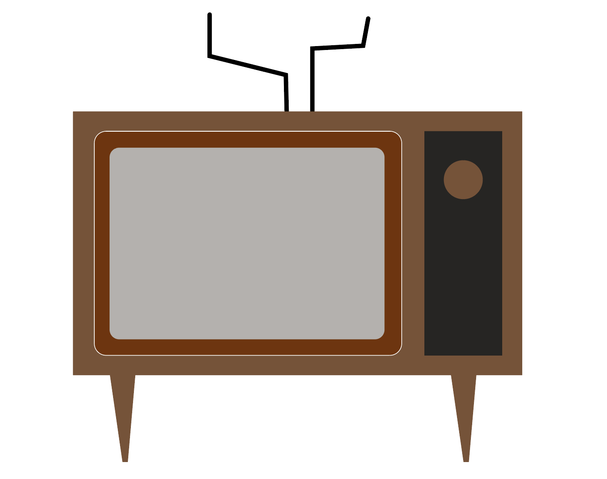
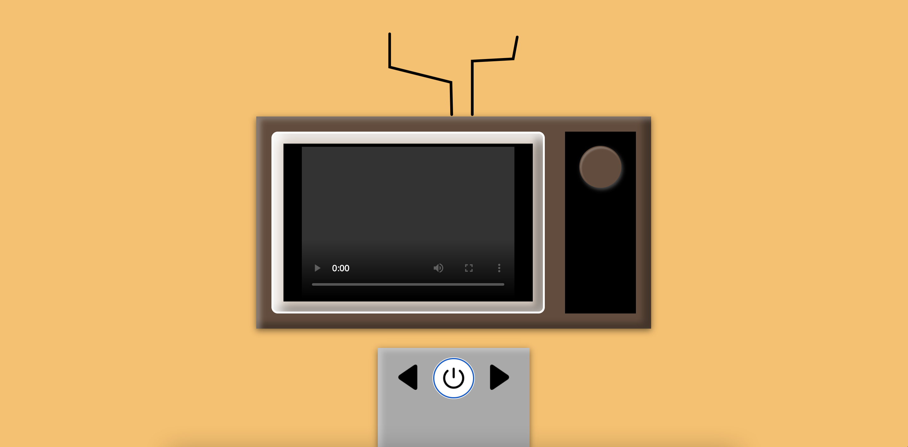
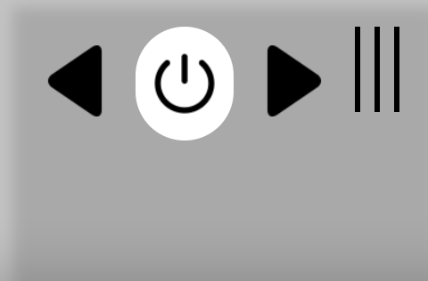
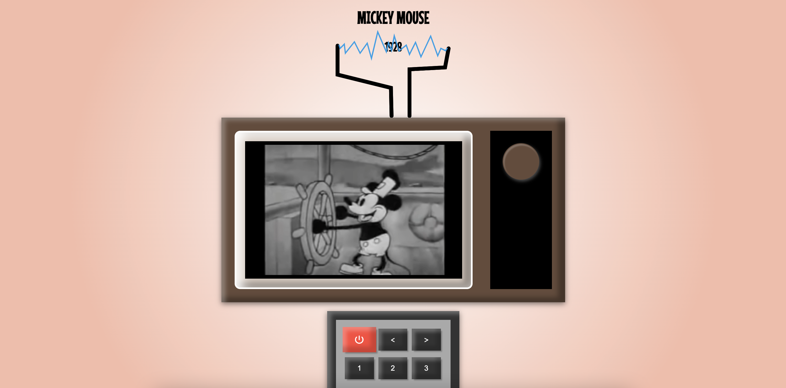

# Procesverslag
Markdown is een simpele manier om HTML te schrijven.  
Markdown cheat cheet: [Hulp bij het schrijven van Markdown](https://github.com/adam-p/markdown-here/wiki/Markdown-Cheatsheet).

Nb. De standaardstructuur en de spartaanse opmaak van de README.md zijn helemaal prima. Het gaat om de inhoud van je procesverslag. Besteedt de tijd voor pracht en praal aan je website.

Nb. Door *open* toe te voegen aan een *details* element kun je deze standaard open zetten. Fijn om dat steeds voor de relevante stuk(ken) te doen.

## Jij

### Ontwerper:
Lotte Stockmans
#### Je startniveau:
Mijn startniveau is: rood

# Je plan

  
Mijn idee is een tvtje maken waar je door de channels kunt klikken en de videos van mickey worden getoond van oud naar jong

  ### De eerste versie/schets:
  

  ### Je ambitie: 
  Aan deze technieken/punten wil ik werken:
  - illustreren met css
  - leuke interacties toevoegen van JS en CSS
  - Animeren met CSS
  - ...
 

## Voortgang/Feedback 1

  
Mijn bevindingen + wijzigingen.
  Deze feedback ging over mijn concept

  ### Bevinding 1:
  Suggestie: Misschien dat ik mijn tv kon veranderen naar de tijd dat het filmpje van mickey was
  #### oplossing:
  Dit heb ik uiteindelijk niet gedaan omdat ik mij voornamelijk heb gefocust op de werking van de tv ipv het uiterlijk.

  ### Bevinding 2:
  Suggestie: De tv in dezelfde stijl tekenen als hoe mickey is getekend, liefst in de oude stijl
  #### oplossing:
  Ik heb uiteindelijk gekozen om mij aan 1 stijl te houden. Die het meest overeenkomt met mickey rond 2004. Omdat ik wel een geillustreerde (met Code) tv wilde en mijzelf wilde uitdagen hierin met voornamelijk shadows.

  ### Bevinding 3:
  Paasei idee: Random knop geeft storing 
  ### oplossing:
  Ik heb hiervoor gekozen om twee antenne's op de tv te plaatsen en als je er overheen hovert dan is er elektriciteit/storing.

  ### Bevinding 4:
  Ze vonden het tv idee het leukste ipv de voetsporen.
  ### oplossing:
  Ik vond dit idee ook het leukste maar ook toepasselijk, dus ik ben hier verder mee gegaan.

  ### Bevinding 5:
  Ik had meer schetsen moeten maken over de interactie van mijn concepten. Nu moest ik nog redelijk veel uitleggen
  ### oplossing:
  Dit neem ik mee voor de volgende opdracht.
  ...

## Voortgang/Feedback 2

  
Mijn bevindingen + wijzigingen 
  Deze feedback ging over mijn eerste versie van mijn concept

    
    

  
  ### Bevinding 1:
  De afstandsbediening zag er nog te nieuw uit
  #### oplossing:
  Ik heb foto's opgezocht van oudere afstandsbedieningen. Ik merkte op dat die vaak alleen maar zwarte knoppen hebben en 1 rode voor de aan en uit knop. Ik heb een schets gemaakt in illustrator eerst en vanuit daar heb ik deze na gemaakt.

  ### Bevinding 2:
  De active states knoppen paste nog niet helemaal bij de knop. Nu was het heel website gericht en niet hoe afstandsbediening knoppen werken 
  #### oplossing:
  Ik heb met border Shadows geprobeert een illusie te creeren dan je de knop echt kan indrukken en dat het dan ook naar binnen lijkt te gaan. Ik denk dat dit uiteindelijk wel gelukt is alleen je ziet niet helemaal de vorm erin terug wat ik jammer vind.

  ### Bevinding 3:
  Mijn code was niet echt te volgen. Er zat geen volgorde in en sommige elementen in de css die bijelkaar hoorde stonden gehusseld door de css heen

  ### oplossing:
  Ik heb wat meer witruimte toe gepast. Stukken code bij elkaar gegroepeerd en hier ook divider comments tussen gezet.

  ### Bevinding 4:
  De groene achtergrond paste niet bij Mickey.
  ### oplossing:
  Ik heb even gekeken naar hoe Mickey meestal door Disney word gepresenteerd en ze hebben heel vaak een radial gradient als achtergroend en mickey in het midden. Omdat mijn tvtje ook in het midden staat heb ik ervoor gekozen om dat ook te doen. Zo creerde ik een focuspunt maar ook een associatie met mickey.

  ### Bevinding 5:
  Focus state mist nog
  ### oplossing:
  Ik heb ervoor gekozen dezelfde focus state te doen als de hover.
  ...

## Voortgang/Feedback 3

  
Mijn bevindingen + wijzigingen
  Deze feedback gaat over mijn laatste feedback

  
  ### Bevinding 1:
  Er miste nog feedfoward over de knoppen
  #### oplossing:
  ik heb iconen en cijfers toegevoegd dat de gebruiker weet wat hij kan verwachten.

  ### Bevinding 2:
  Er miste nog Custom properties
  #### oplossing:
  Ik heb er1tje toegevoegd omdat ik niet zag dat dit van toepassing op mijn concept is, want ik heb veel styling elementen maar niet veel dezelfde content blokken zoals tekst. Bij nader inzien had ik wel een leuke darkmode kunnen toepassen.

  ### Bevinding 3:
  De zwart in de tv is te zwart. Waardoor he iets te heftig overkomt en ook minder mooi
  ### oplossing:
  Ik heb het iets grijzer gemaakt van #000000 naar 

  ### Bevinding 4:
  Mijn code is niet helemaal netjes. Er zit JS in mijn HTML
  ### oplossing:
  Ik heb opgezocht hoe ik de "on click" in mijn HTML kon veranderen naar een Event Listener en dit is uitendelijk gelukt. Nu zit er geen CSS of JS in mijn HTML

  ### bevinding 5:
  Van de vuurwerk zag je het pad nog lopen die gevuld word
  ### oplossing:
  Ik heb een lineare gradient toegepst die bijna perfect overloopt met de achtergrond waardoor je alleen de vuurwerk ziet en niet het pad erachter.

## Reflectie

  
Mijn eindresultaat & persoonlijke ontwikkeling

  ### Je uitkomst - karakteristiek screenshot(s):
  

  ### Dit ging goed/Heb ik geleerd: 
  Ik heb geleerd om veel dingen zelf op te lossen. In mijn vorige jaren van CMD heb ik dit ook geleerd alleen destijd sheb ik heel veel hulp gekregen en ondersteuning van klasgenoten en docenten, waardoor ik eigenlijk zelf niet de uurtjes heb gemaakt. Dit vaak heb ik veel eerst zlef geprobeerd en als het echt niet lukte gevragd. Tot mijn verbazing ging dit echt goed. Ik had behalve dan het woordje "src" in 1 middag wel goede JS geschreven, terwijl ik die ochtend dacht dat dit mij nooit ging lukken. Ik ook veel meer oefening gehad met CSS en waar ik in jaar 1 en 2 mee struggelde heb ik eindelijk het gevoel dat ik de bsics wél onder de knie heb.

  ### Dit was lastig/Is niet gelukt:
  Het is mij niet gelukt om meerdere tvs te maken in CSS die dan zouden mee veranderen. Dit was mijn originele plan maar die heb ik met de realitiet wel moeten veranderen. Wat opzich niet erg is. Ook zitten er een paar schoonheids foutjes tussen. 
  ook vond ik het lastig om klasgenoten te helpen met hun code. Er werd gezegd dat rode piste naast de blauwe moest gaan zitten alleen ik heb niet het gevoel gehad dat ik op dat level was dat ik inhoudelijk wel veel kon uitleggen of kon oplossen.

  Ook vond ik het lastig om op google het verchil te zien tussen "vanilla" code en minder nette code. Hierdoor had ik best wat dingen in mijn code staan die ik later nog moest aanpassen omdat het niet helemaal de bedoeling was om bijvoorbeeld een on click in je HTML te zetten.

## Bronnenlijst

continu bijhouden terwijl je werkt

Nb. Wees specifiek ('css-tricks' als bron is bijv. niet specifiek genoeg).

1. https://www.youtube.com/watch?v=K4K7HNavK4U&t=90s + https://codepen.io/MinzCode/pen/abmwmOG
2. https://cssgradient.io/
3. https://html-css-js.com/css/generator/box-shadow/
4. https://www.youtube.com/watch?v=DvOyEgBFsBE&t=193s
5. https://www.youtube.com/watch?v=uAAD3mmQGRQ
6. https://www.youtube.com/watch?v=oigfaZ5ApsM&t=186s
7. https://www.youtube.com/watch?v=xwKbtUP87Dk
8. https://www.youtube.com/watch?v=DNBZgQOumFg
9. Videos van mickey : Youtube
10. https://css-tricks.com/snippets/css/a-guide-to-flexbox/
11. https://stackoverflow.com/questions/2881307/can-i-have-two-javascript-onclick-events-in-one-element

